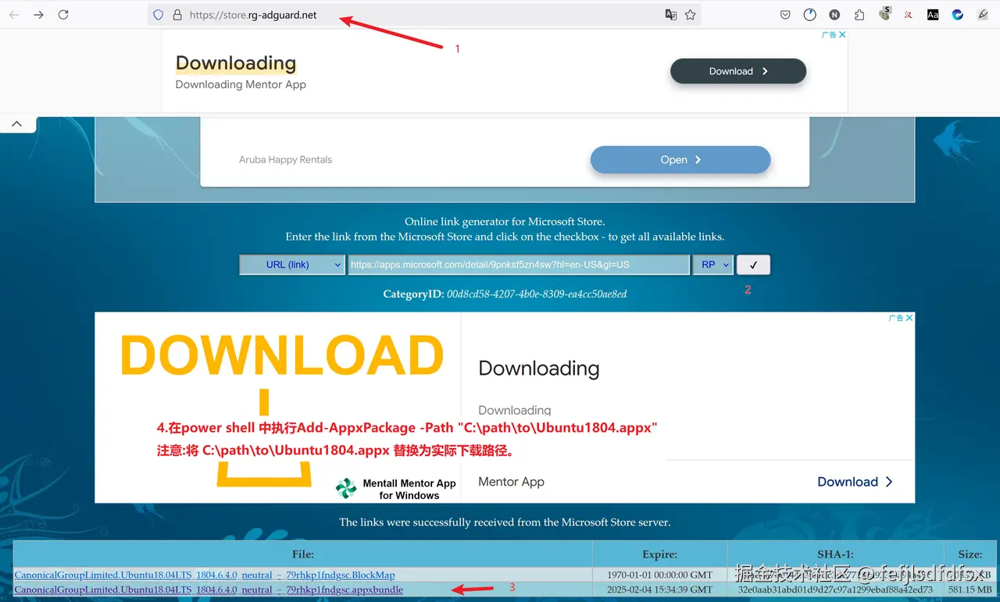
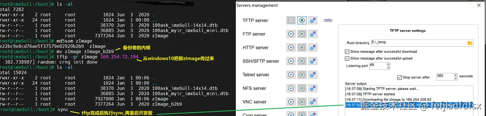

# 使用wsl2搭建韦东山imx6ull pro开发板的开发环境

&#x20;  现在linux开发环境一般比较复杂,以韦东山的imx6ull pro开发板为例,需要使用vmware运行虚拟机,然后打通 开发板<->虚拟机<->windows桌面这3者的互通,导致很复杂,本文通过wsl2编译镜像,去掉vmware环境,开发板只从windows桌面传递文件,减少环境的复杂性.开发板和windows桌面的连接是参考《嵌入式Linux应用开发完全手册V5.2\_IMX6ULL\_Pro开发板.pdf》的《第四 A 章 使用 USB 网卡直连配置网络》方法.

## 安装wsl2的ubuntu 18.04版本

为了保持环境的一致性,还是需要安装ubuntu 18.04.我在微软store下载wsl的ubuntu18.04直接闪退,后来了解到在  [https://store.rg-adguard.net/](https://link.zhihu.com/?target=https%3A//store.rg-adguard.net/) 可以下载商店的软件包,然后用如下 1\~4步,其中第4步是在powershell中安装下载的.appx的离线包:



```plain&#x20;text

Add-AppxPackage -Path "C:\path\to\Ubuntu1804.appx"

注意:将 C:\path\to\Ubuntu1804.appx 替换为实际下载路径。

```

因为把ubuntu 18.04 后续编译buildroot导致会占用C盘空间太多,所以一开始就转到E盘,参考如下:

```shell

PS C:\Users\nisy_tc> wsl --shutdown

PS C:\Users\nisy_tc> wsl --export Ubuntu-18.04 D:\_temp\ubuntu-18.04.tar

正在导出，这可能需要几分钟时间。...: ./var/lib/lxd/unix.socket: pax format cannot archive sock

操作成功完成。

PS C:\Users\nisy_tc> wsl --unregister Ubuntu-18.04

正在注销。

操作成功完成。

PS C:\Users\nisy_tc> wsl --import Ubuntu-18.04 E:\_wsl_ubuntu18.04 D:\_temp\ubuntu-18.04.tar

正在导入，这可能需要几分钟时间。

操作成功完成。

PS C:\Users\nisy_tc>

```

## wsl2的ubuntu 18.04基本配置和编译Buildroot

启动ubunut 18.04后,添加book账户:

```shell

sudo useradd -m -s /bin/bash book

sudo passwd book                  ##输入密码123456

sudo usermod -aG sudo book

```

按照<嵌入式Linux应用开发完全手册V5.2\_IMX6ULL\_Pro开发板.pdf> 文档的<2.2 安装 Ubuntu 软件 >章节:

```shell

git clone https://e.coding.net/weidongshan/DevelopmentEnvConf.git

cd DevelopmentEnvConf  

sudo ./Configuring_ubuntu.sh

```

配置git

```shell

git config --global user.email "user@100ask.com"

git config --global user.name "100ask"

```

<2.6.2 下载 BSP >章节执行如下命令:

```shell

book@100ask:~$ git clone https://e.coding.net/codebug8/repo.git

 

book@100ask:~$ mkdir -p 100ask_imx6ull-sdk && cd 100ask_imx6ull-sdk  

book@100ask:~/100ask_imx6ull-sdk$ ../repo/repo init -u https://gitee.com/weidongshan/manifests.git -b linux-sdk -m imx6ull/100ask_imx6ull_linux4.9.88_release.xml  --no-repo-verify

book@100ask:~/100ask_imx6ull-sdk$  ../repo/repo sync -j4

```

但是我这里repo init 出现报错:"repo: error: unknown branch "master"",所以安装了国内源的repo,再重新repo init后就可以了:

```sql

git clone https://mirrors.tuna.tsinghua.edu.cn/git/git-repo

../git-repo/repo init -u https://gitee.com/weidongshan/manifests.git -b linux-sdk -m imx6ull/100ask_imx6ull_linux4.9.88_release.xml --no-repo-verify

```

执行Buildroot 后,编译成功后文件输出路径为 output/images :

```sql

buildroot2020.02.x  

  ├── output

    ├── images  

      ├── 100ask_imx6ull-14x14.dtb <--设备树文件  

      ├── rootfs.ext2         <--ext2 格式根文件系统

      ├── rootfs.ext4 -> rootfs.ext2    <--ext2 格式根文件系统  

      ├── rootfs.tar          

      ├── rootfs.tar.bz2       <--打包并压缩的根文件系统，用于NFSROOT 启动

      ├── 100ask-imx6ull-pro-512d-systemv-v1.img      <--完整的系统镜像(可以用来烧写 emmc 和 sd 卡)

      ├── u-boot-dtb.imx       <--u-boot 镜像

      └── zImage          <--内核镜像

```

## 整体升级

&#x20; wsl编译的100ask-imx6ull-pro-512d-systemv-v1.img 直接拷贝到windows桌面的E盘,即wsl2的 /mnt/e/,然后按照<嵌入式Linux应用开发完全手册V5.2\_IMX6ULL\_Pro开发板.pdf>文档的描述:

> &#x20; 可以参考章节《烧写整个系统或更新部分系统》把上面编译出来的 100ask-imx6ull-pro-512d-systemv-v1.img 重命名为 emmc.img(或 sdcard.img)，把 emmc.img(或 sdcard.img)放到“100ask\_imx6ull 烧写工具”的 files 目录里，就可以使用工具烧写到 EMMC(或 SD/TF卡)。&#x20;

注意:

*   100ask\_imx6ull\_flashing\_tool\_v4.0.exe  不要在有空格或者标点符号的路径下运行

*   Usb otg口升级时,需要直连电脑,不能经过usb hub


## 只升级zImage和dtb

使用tftp按照如下命令格式:

```
//从对方IP地址接收文件
tftp -gr 文件名 对方IP地址

//向对方IP地址发送文件
tftp -pr 文件名 对方IP地址

```

把zImage和dtb从windows桌面传到开发板的/boot下,然后重启即生效,参考如下:



注:因为开发板又有emmc,又有sd卡,并且烧sd卡时需要先上电再拔卡,导致容易混乱,我是直接放弃使用sd卡,只使用emmc.

## 在windows下浏览wsl2里的代码

通过ssh插件,操作如下:


